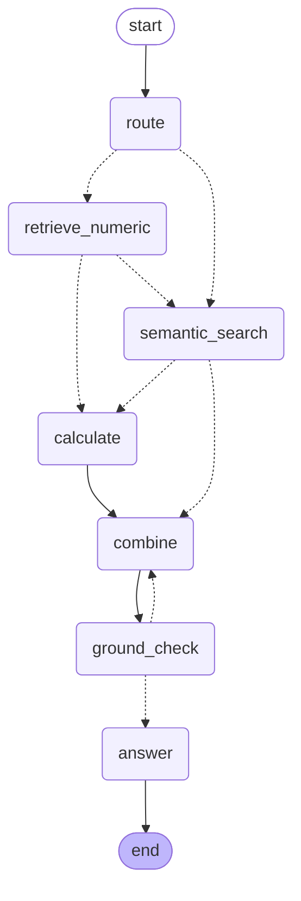

```mermaid
graph TD;
    __start__([start]):::first
    route(route)
    retrieve_numeric(retrieve_numeric)
    semantic_search(semantic_search)
    calculate(calculate)
    combine(combine)
    ground_check(ground_check)
    answer(answer)
    __end__([end]):::last
    __start__ --> route;
    route -.-> retrieve_numeric;
    route -.-> semantic_search;
    retrieve_numeric -.-> calculate;
    retrieve_numeric -.-> semantic_search;
    semantic_search -.-> calculate;
    semantic_search -.-> combine;
    calculate --> combine;
    combine --> ground_check;
    ground_check -.-> answer;
    ground_check -.-> combine;
    answer --> __end__;
    classDef default fill:#f2f0ff,line-height:1.2
    classDef first fill-opacity:0
    classDef last fill:#bfb6fc
```